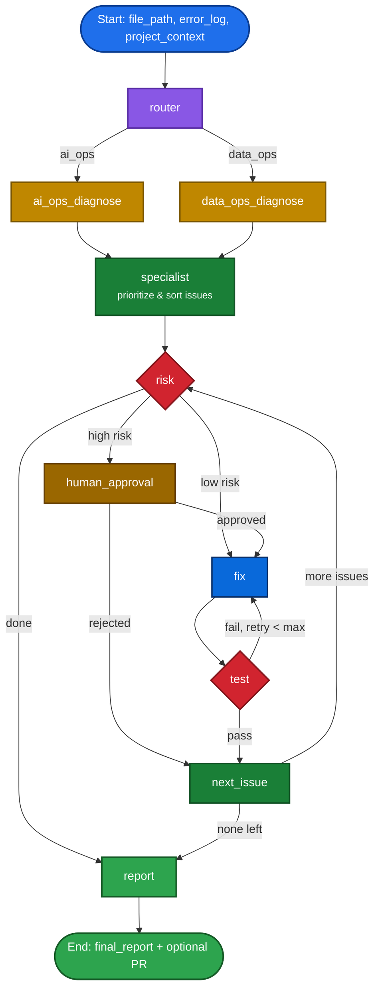

# AI-Ops Agent

An autonomous production-code reviewer built with **LangGraph**. It diagnoses a code file for production risk, routes the problem to a domain specialist (AI-Ops vs. Data-Ops), assesses the risk of each fix, auto-applies low-risk fixes, escalates high-risk ones for human approval, tests every fix in a sandbox loop with retries, and can open a GitHub pull request automatically — all as a single graph run.

## What it does

Point it at a code file (optionally with a stack trace and project context) and it will:

1. **Route** the file to the right specialist — AI-Ops (agentic loops, LangGraph state, prompt/context handling, LLM call patterns) or Data-Ops (ETL pipelines, resource leaks, batch/Spark jobs, memory constraints).
2. **Diagnose** production issues in that file, each scored with a severity (`critical`/`high`/`medium`/`low`) and a confidence score.
3. **Assess risk** per issue — is a fix safe to auto-apply, or does it need a human to approve it first?
4. **Fix** low-risk issues automatically; route high-risk issues to a human-approval step.
5. **Test** every applied fix in a sandboxed check, and retry the fix (up to a configurable limit) if the test fails.
6. **Report** a final summary of everything found, fixed, flagged, or rejected.
7. **Optionally open a PR** — if a GitHub token is configured, low-risk fixes are pushed to a `aiops/hotfix/*` branch and a pull request is opened automatically.

## Architecture




The graph itself is built and compiled in `backend/app/agent/graph.py` using `StateGraph`, with `MemorySaver` as the checkpointer (each run gets its own `thread_id`).

### Repository structure

```
ai-ops-agent/
├──.github/workflows/
    ├── ci.yml                     # CI/CD pipeline for automated testing and linting
├── backend/
│   ├── requirements.txt
│   └── app/
│       ├── main.py                # Entry point — run a single file review
│       ├── config.py              # Env-driven config, severity sort, confidence filter
│       ├── test_agent.py          # Scenario-based test runner (with LangSmith tracing check)
│       ├── agent/
│       │   ├── graph.py           # StateGraph definition — nodes & routing logic
│       │   ├── nodes.py           # router, diagnose, specialist, risk, fix, test, report nodes
│       │   ├── state.py           # AgentState / DiagnosisResult / ProposedFix schemas
│       │   ├── tools.py           # Structured tools bound to the LLM (Groq) for each step
│       │   └── prompts.py         # System + per-node prompt templates
│       └── utils/
│           └── git_client.py      # Creates hotfix branches & opens PRs via GitHub API
└── README.md
```

### Key design points

- **Domain routing, not a single generic reviewer.** The `router` node classifies the file as `ai_ops` or `data_ops` before diagnosis even starts, so the diagnostic prompt is specialized (e.g. context-overflow and rate-limit checks for agentic code vs. resource-leak and OOM checks for pipeline code).
- **Risk-gated autonomy.** Every proposed fix passes through a `risk` node that classifies it `low` or `high`. Low-risk, reversible fixes are auto-applied; anything else stops for human approval (`human_approved` in state) before a fix is attempted. This is the safety boundary that makes autonomous fixing viable in a production-adjacent context.
- **Sandboxed test-and-retry loop.** After a fix is applied, the `test` node checks it; on failure the graph loops back to `fix` (up to `MAX_RETRIES`, default 3) before giving up and moving to the next issue.
- **Structured tool calls, not free-text parsing.** Every node's LLM call is bound to a `StructuredTool` (`route_domain`, `diagnose_issue`, `risk_assessor`, `generate_fix`, `test_fix`) via `langchain_groq`, so outputs are typed JSON rather than parsed prose.
- **Optional GitHub automation.** `git_client.py` creates a `aiops/hotfix/<timestamp>-<slug>` branch and opens a PR automatically when a `GITHUB_TOKEN` and `GITHUB_REPO` are configured — otherwise this step is a no-op.

## Tech Stack

- **LangGraph** — agent orchestration (`StateGraph`, conditional edges, `MemorySaver` checkpointing)
- **LangChain + langchain-groq** — LLM binding and structured tool calls
- **Groq** (`llama-3.3-70b-versatile` by default) — inference
- **LangSmith** — optional tracing (checked for in `test_agent.py`)
- **Python** — `dataclasses`, `TypedDict`-based state schema
- **GitHub REST API** — automated hotfix branches and PRs

## Getting Started

### Prerequisites

- Python 3.10+
- A Groq API key
- (Optional) A GitHub personal access token with `repo` scope, if you want auto-PR

### Installation

```bash
git clone https://github.com/shehryarDE/ai-ops-agent.git
cd ai-ops-agent/backend
pip install -r requirements.txt
```

### Configuration

Create a `.env` file inside `backend/`:

```
GROQ_API_KEY=your_groq_key_here

# Optional — model tuning
MODEL_NAME=llama-3.3-70b-versatile
TEMPERATURE=0.1
MAX_TOKENS=2048

# Optional — auto-PR on low-risk fixes
GITHUB_TOKEN=your_github_pat
GITHUB_REPO=owner/repo
GIT_BASE_BRANCH=main

# Optional — agent behaviour
MAX_RETRIES=3
AUTO_FIX_ENABLED=true
MIN_CONFIDENCE=0.75

# Optional — LangSmith tracing
LANGSMITH_TRACING=true
LANGSMITH_PROJECT=ai-ops-agent
```

### Running the agent

Edit the `file_path` (and optionally `project_context` / `error_log`) at the bottom of `main.py`, then:

```bash
cd backend
python -m app.main
```

Or import and call `run()` directly:

```python
from app.main import run

run(
    file_path="your_file.py",
    project_context="LangGraph agent for automated camera configuration (CamConfig-AI).",
    error_log="",  # paste a stack trace here if you have one
)
```

### Running the test scenarios

```bash
cd backend
python -m app.test_agent
```

## Roadmap

- [ ] Multi-file / full-repo review support
- [ ] CI integration (run automatically on PR open)
- [ ] Web dashboard for reviewing risk decisions and fix history
- [ ] Expand specialist domains beyond AI-Ops / Data-Ops
- [ ] **Loop engineering** — tighter control over the fix→test retry loop (adaptive retry limits based on issue severity, loop-state memory so retries learn from prior failed attempts instead of repeating them, and cycle detection to stop the agent from oscillating between two failing fixes)
- [ ] **Production-grade scalability** — move off in-memory `MemorySaver` to a persistent checkpointer (Postgres/Redis) for durability across restarts, support concurrent multi-repo/multi-file runs via async graph execution, add queue-based job processing for large codebases, and rate-limit/backoff handling for the Groq API under load

## License

MIT
